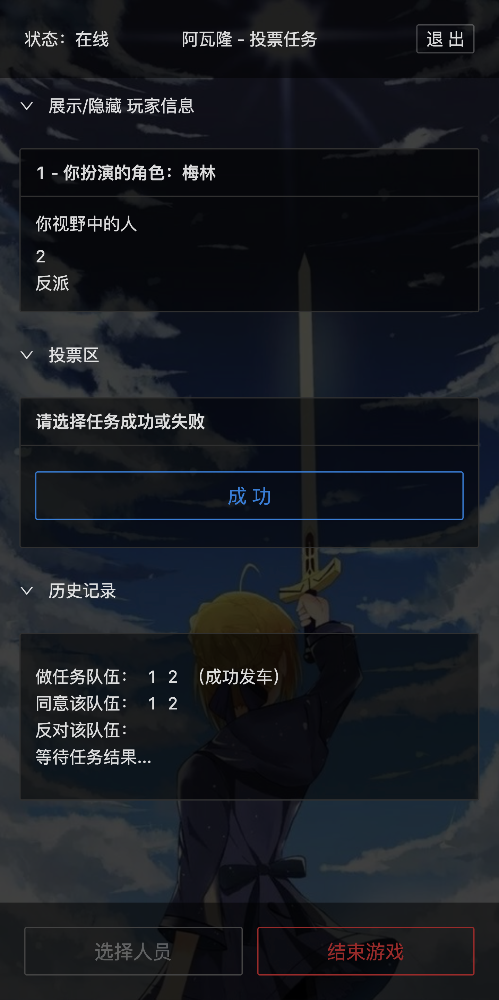

# Avalon Web Play (WIP) 

## Screenshot


## Deployment pre-request

Node.js 16+ or Docker

## Development

```bash
npm ci
npm run dev
```

## Deployment - Node.js

```bash
npm ci
npm run build
npm start
```

## Deployment - Docker

-   Self Built

```bash
docker build -t avalon .
docker run -d -p 3100:3100 avalon
```

-   [Official DockerHub Image](https://hub.docker.com/repository/docker/hlhr202/avalon)

```bash
docker pull hlhr202/avalon:latest
docker run -d -p 3100:3100 hlhr202/avalon
```
